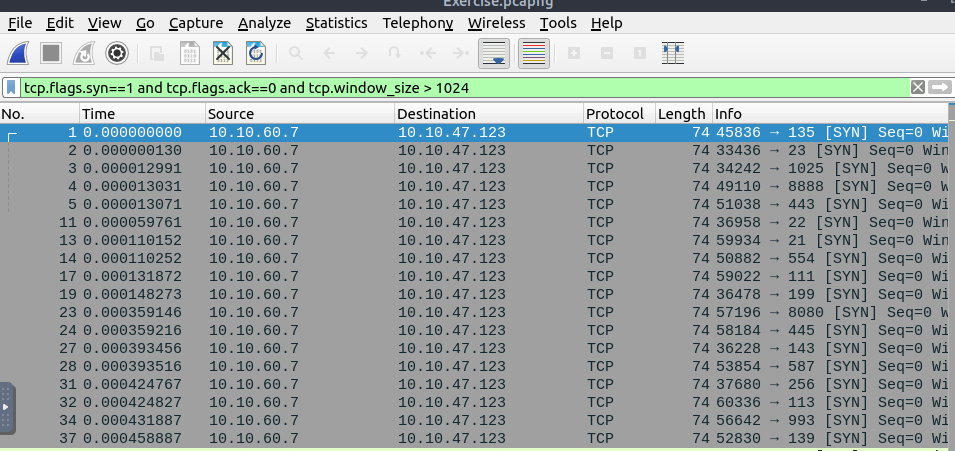
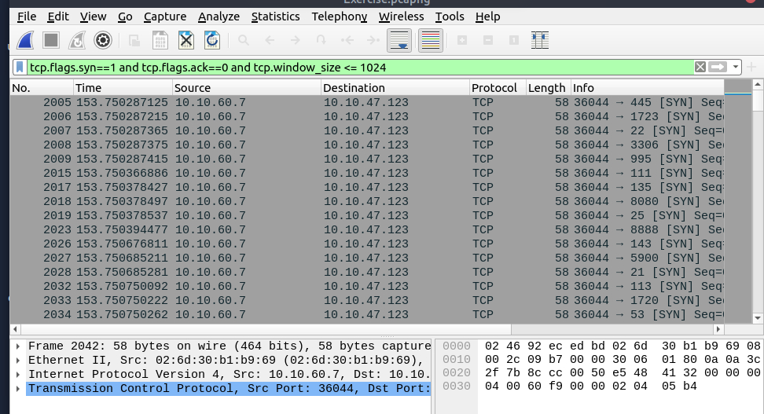
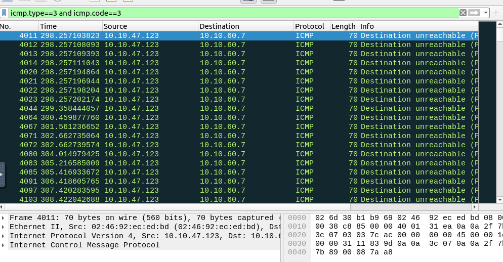

# Wireshark – Nmap & UDP Scan Analysis Lab
**Date:** 09/07/2025  
**Tools:** Wireshark  
**Difficulty:** Medium  
**Objective:** Identify Nmap TCP and UDP scans in a network capture and analyze anomalous traffic patterns.

---

### Note
PCAPs and lab scenarios provided by TryHackMe’s *Wireshark: Traffic Analysis* room. All analysis and write-up are my own.

---

## Identifying Nmap Scans with Wireshark
Nmap is commonly used during the **active reconnaissance** phase of an attack. Threat actors use Nmap to scan networks for open ports and potentially exploitable services. Wireshark allows us to observe and identify these scanning behaviors.

---

### TCP Connect Scans
Nmap TCP connect scans rely on the full three-way handshake, usually executed with:  

```bash
nmap -sT
```

**Open port flow:**
```
(nmap) SYN  ->
(server) <- SYN, ACK
(nmap) ACK  ->
(nmap) RST, ACK ->
```

**Closed port flow:**
```
(nmap) SYN  ->
(server) <- RST, ACK
```

**Wireshark filter for initial anomalies:**
```text
tcp.flags.syn==1 and tcp.flags.ack==0 and tcp.window_size > 1024
```



*Observation:* Rapid sequences of SYN packets to multiple ports indicate scanning. Packet lengths of 74 bytes are typical for TCP packets with options.

---

### Nmap SYN Scans
SYN scans (`nmap -sS`) send a TCP SYN packet but **do not complete the handshake**. Only an initial SYN/ACK response is needed to confirm that a port is open.  

**Open port flow:**
```
(nmap) SYN  ->
(server) <- SYN, ACK
(nmap) RST  ->
```

**Wireshark filter for SYN scans:**
```text
tcp.flags.syn==1 and tcp.flags.ack==0 and tcp.window_size <= 1024
```

*Observation:* Packet size is usually less than 1024 bytes because the handshake is not completed.



---

### UDP Scans
UDP scans do not use a handshake. Open ports simply receive the packet; closed ports respond with an ICMP “Destination Unreachable” message (`Type 3, Code 3`).  

**Wireshark filter for closed UDP ports:**
```text
icmp.type==3 and icmp.code==3
```

*Example:*  
- **Open UDP port:** packet received without ICMP error.  
- **Closed UDP port:** ICMP Destination Unreachable message returned.  

Nmap command for UDP scanning:
```bash
nmap -sU
```



---

## Summary
- Identified TCP and UDP scanning activity using Wireshark.  
- Differentiated **Connect vs SYN scans** using TCP flags and window sizes.  
- Detected closed UDP ports via ICMP responses.  

