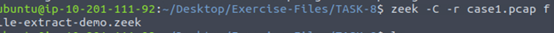
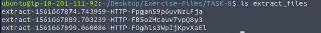
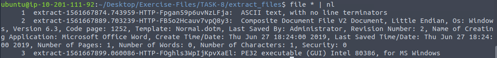
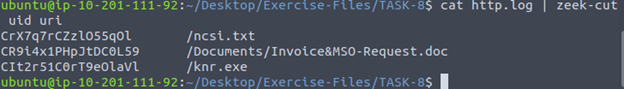
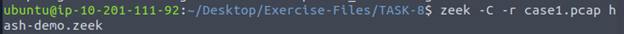
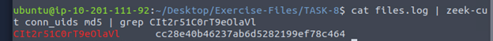

# Lab 1: Extracting Suspicious Files with Zeek

**Note:** PCAPs and lab environment are from the TryHackMe *Zeek* room.  
Analysis, screenshots, and commentary are my own.

---

## Objective
Demonstrate how Zeek’s File Framework can extract files from a packet capture (PCAP), 
identify file types, and correlate them across multiple Zeek logs to detect potentially malicious files.

---

## Tools Used
- Zeek
- Linux command-line utilities (`file`, `grep`, `zeek-cut`, `less`)

---
## Table of Contents
- [Create a Zeek script which loads the File extraction Policy](#1-create-a-zeek-script-which-loads-the-file-extraction-policy)
- [Run Zeek on the PCAP with the File Extraction Policy](#2-run-zeek-on-the-pcap-with-the-file-extraction-policy)
- [Verify Extracted Files](#3-verify-extracted-files)
- [Identify file types](#4-identify-file-types)
- [Identify the Uri](#4-identify-the-uri)
- [Use Hashes to check files](#6-we-can-use-hashes-to-check-if-the-files-are-malicious-using-sites-like-virus-total-we-find-the-hashes-by-running-zeeks-hash-framework)
- [Look at files.log for hashes](#7-we-can-now-look-at-the-fileslog-to-grab-the-md5-sha1-or-sha256-hash-of-the-suspicious-executable)
---

## Steps

## 1. Create A Zeek script which loads the File extraction Policy
```
echo @load /opt/zeek/share/zeek/policy/frameworks/files/extract-all-files.zeek > extract-allfiles.zeek
```
## 2. Run Zeek on the PCAP with the File Extraction Policy

Running the following command will run a custom Zeek script with the native File Extraction framework included using the @load
```
zeek -C -r case1.pcap /opt/zeek/share/zeek/policy/frameworks/files/extract-all-files.zeek
```


## 3. Verify Extracted Files  
A new folder extract_files/ is created with the captured files
You can view them by using ls extract files.



## 4. Identify file types
Next up you can identify the file types of the extracted files using the following command
```
file * 
```


## 5. Identify the Uri
You can also check the http.log, filter by the UID and Uri to get the name of the downloaded files.



## 6. We can use hashes to check if the files are malicious using sites like Virus total. We find the Hashes by running Zeek's Hash framework.
```
zeek -C -r case.pcap hash-demo.zeek
```


## 7. We can now look at the files.log to grab the md5 sha1 or sha256 hash of the suspicious executable
```
cat files.log | zeek-cut conn_uids md5 | grep"CIt2r51C0rT9eOlaVl"
```

