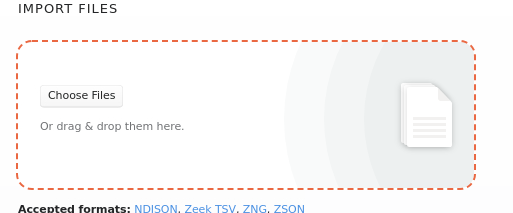
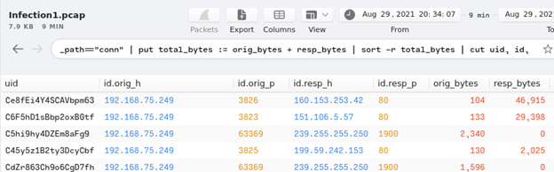
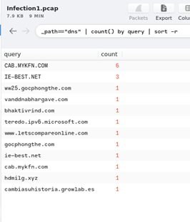
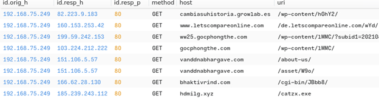
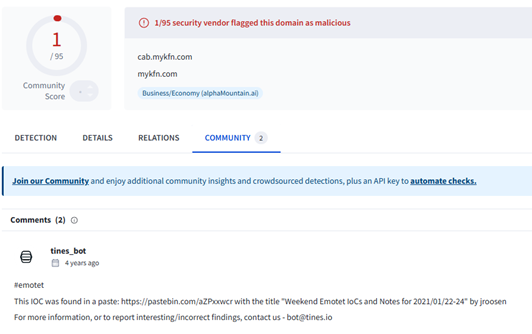
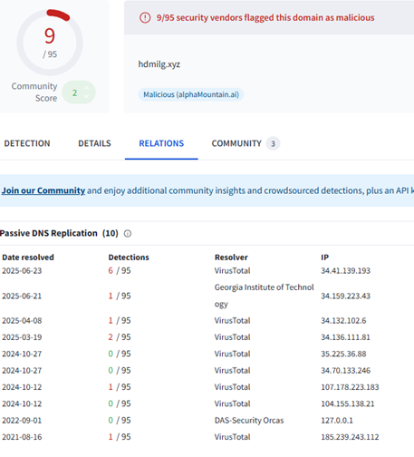

**Network Forensics Lab**

Date: 09/05/2025

Tools: Brim / Zui

Note: Traffic and PCAPS are taken from TryHackMe's "Masterminds" room. All analysis and observations are my own.
 
---
**Scenario**
Three machines were infected with unknown malware, likely from a phishing email and an infected USB drive. Network traffic packet captures (one per machine) were collected. Using Zui, we analyzed the traffic to investigate the attack, identify malicious activity, and determine the responsible threat actor.

**Suspected Initial Compromise:** Phishing campaign and infected USB drive

**Goal:** Track malware spread and identify the threat group using network analysis.

---
**Investigation Summary**

**Victim Host:** 192.168.75.249

**•	Step 1: Imported PCAP from incident response team**

o	Observed baseline traffic and unusual connection spikes

---
**•	Step 2: Queried conn.log**

o	Host 192.168.75.249 received multiple suspicious connections

---
**•	Step 3: Analyzed unique DNS requests**
o	Queries to CAB.MYFKN.COM observed

---
**•	Step 4: Checked DNS against CTI feeds**

o CAB.MYFKN.COM flagged as malicious

o	No direct Emotet downloads; files from other domains appear suspicious

---
**•	Step 5: Queried HTTP logs**

o	No files from CAB.MYFKN.COM, but several downloaded from other malicious domains

---

**•	Step 6: Cross-checked suspicious files/domains with VirusTotal**

o	Executable files flagged as potentially harmful

o	Indicates malware delivery activity

---
**•	Step 7: Other infected hosts**

o	Similar behavior observed, suggesting lateral spread
---
**Indicators of Compromise (IOCs)**

**1. Victim Host IP**	192.168.75.249

**2. Suspicious Domains / IPs**	CAB[.]MYFKN[.]COM, [other malicious domains]

**3.** Unusual File Transfers / Commands	Executables retrieved from malicious domains

**4.** Other Observations	DNS and connection patterns indicate malware activity; lateral movement likely
---
**Key Takeaways**

•	Identified anomalous host behavior using network traffic analysis

•	Correlated network activity with threat intelligence to highlight malicious domains

•	Documented IOCs and assessed malware spread across multiple endpoints

